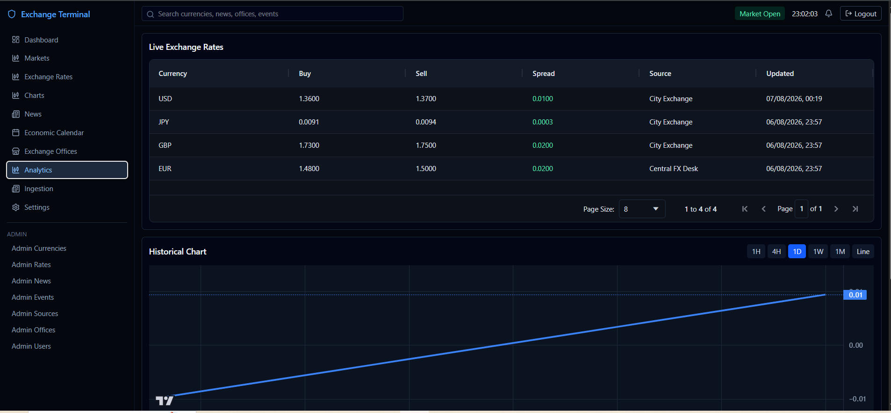
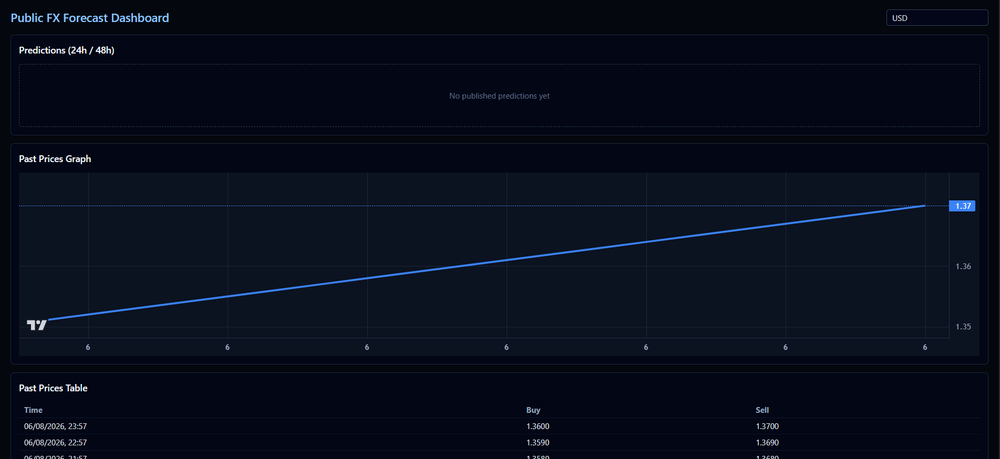
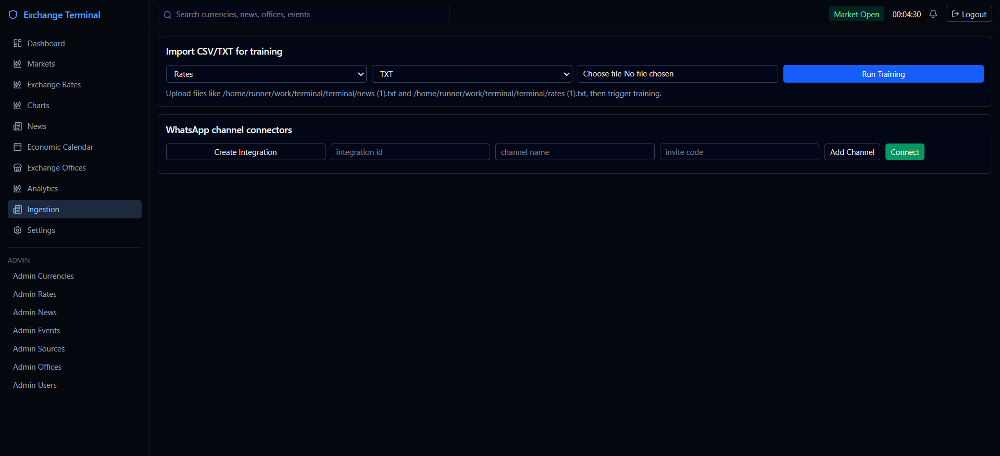
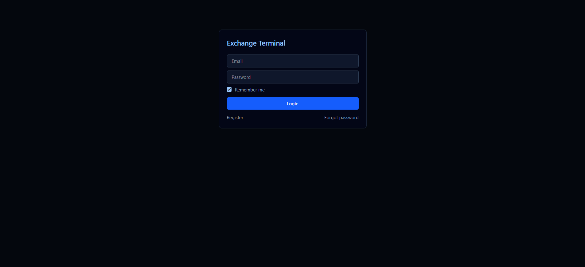

<div align="right">

</div>

<div align="center">
  <h2>Exchange Terminal</h2>
  <i>A modern, Bloomberg-style FX market terminal with admin-controlled data ingestion and a dark professional UI.</i>
  <br/>
  <br/>
</div>

<div align="center">

<!-- Badges kept generic to avoid broken links on forks -->


</div>

<br/>

Exchange Terminal is a full-stack currency exchange terminal for managing and visualizing FX data. It supports role-based admin operations, manual market/news/event entry, and a clean, dark dashboard for analysts and operators. The repository also includes an optional Python FastAPI microservice for ML forecasting.

<hr/>

## :fast_forward: Quick Links

- [:book: What is included](#heading-1)
- [:rocket: Features](#heading-2)
- [:wrench: Setup](#heading-3)
- [:gear: Prerequisites](#heading-4)
- [:computer: Technologies](#heading-5)
- [:triangular_ruler: Project Structure](#heading-6)
- [:bar_chart: API Overview](#heading-7)
- [:busts_in_silhouette: Contributors](#heading-10)
- [:computer: Project Setup Guide](#heading-15)

<hr/>

## :question: What is included <a id="heading-1"></a>

This repository provides a complete web-based FX terminal consisting of:

- Admin Dashboard (data management and ingestion)
- User Dashboard (Bloomberg-style terminal UI)
- Node.js + Express + Prisma backend (PostgreSQL)
- React + TypeScript + Vite frontend
- Optional Python FastAPI forecasting microservice (LightGBM)
- Seed scripts and public read-only dashboard routes

## :fire: Features <a id="heading-2"></a>

- Authentication and authorization (JWT, roles: ADMIN, USER)
- Admin CRUD for: Currencies, Exchange Rates, News, Economic Events, Sources, Exchange Offices, Users
- Bloomberg-style dashboard: live rates table, historical charts, news, calendar, market summary
- Global search across currencies/news/offices/events
- API-level filtering and pagination
- ML forecasting service

## Screens






## :hammer_and_wrench: Technologies: <a id="heading-5"></a>

|                                               postgresql                                                |                                                  FastAPI                                                   |                                               Python                                                |                                               ReactJS                                                |                                                NodeJS                                                 |
|:-------------------------------------------------------------------------------------------------------:|:----------------------------------------------------------------------------------------------------------:|:---------------------------------------------------------------------------------------------------:| :--------------------------------------------------------------------------------------------------: | :---------------------------------------------------------------------------------------------------: |
| <a href="https://postgresql.org/"></a> | <a href="https://fastapi.tiangolo.com/"></a> | <a href="https://www.python.org/"></a> | <a href="https://reactjs.org/"></a> | <a href="https://nodejs.org/en/"></a> |

### Environment Variables

Backend (`backend/.env`) — copy from `backend/.env.example` and set:

```bash
DATABASE_URL="******localhost:5432/exchange_terminal"
PORT=4000
JWT_SECRET="change-me"
JWT_EXPIRES_IN="1d"
JWT_REMEMBER_EXPIRES_IN="30d"
CORS_ORIGIN="http://localhost:5173"
```

Frontend (`frontend/.env`) — copy from `frontend/.env.example`:

```bash
VITE_API_URL="http://localhost:4000"
```

Forecast service (`forecast_service/.env` optional): not required by default. See service README section below for runtime.

### Install dependencies

From repository root:

```bash
cd backend && npm install
cd ../frontend && npm install
```

### Database (Prisma + PostgreSQL)

```bash
cd backend
npm run prisma:generate
npm run prisma:migrate
npm run prisma:seed
```

Seed creates sample users, currencies, sources, exchange rates, historical rates, news, economic events, and exchange offices.

Default users after seeding:
- Admin: `admin@exchange.local` / `Password123!`
- User: `user@exchange.local` / `Password123!`

### Run Locally

Open two terminals:

Terminal 1 — Backend
```bash
cd backend
npm run dev
```

Terminal 2 — Frontend
```bash
cd frontend
npm run dev
```

Then open http://localhost:5173

## :information_source: Prerequisites <a id="heading-4"></a>

- Node.js 18.x or 20.x
- PostgreSQL 14+ (local or remote)
- (Optional) Python 3.10+ for the forecasting service

If running the forecasting service, ensure ports are available:
- Backend: 4000 (default)
- Frontend (Vite): 5173 (default)
- Forecast service (Uvicorn): 8000 (default)

## :computer: Technologies <a id="heading-5"></a>

- React, TypeScript, Vite, Tailwind CSS, React Router, React Query, Axios, AG Grid, TradingView Lightweight Charts
- Node.js, Express, TypeScript, Prisma ORM, PostgreSQL, JWT, bcrypt
- Python, FastAPI, Uvicorn, LightGBM, Pandas, NumPy, Joblib

## :triangular_ruler: Project Structure <a id="heading-6"></a>

```
terminal/
  backend/
    prisma/
    src/
  frontend/
    src/
  forecast_service/
    app/
    tests/
```

## :bar_chart: API Overview <a id="heading-7"></a>

- POST /auth/register
- POST /auth/login
- GET /auth/profile
- CRUD: /currencies, /sources, /exchange-rates, /news, /economic-events, /exchange-offices
- GET /historical-rates
- GET /search?q=...
- Admin users: GET /users, PATCH /users/:id/role, PATCH /users/:id/status

Public read-only (selected):
- GET /public/predictions
- GET /public/historical-series
- GET /public/historical-table

## :people_holding_hands: Contributors <a id="heading-10"></a>

Contributions are welcome! Please open an issue or submit a PR.

## :computer: Project Setup Guide <a id="heading-15"></a>

This section provides detailed instructions for setting up and running each component of the Exchange Terminal.

### Backend (Node.js + Express)

```bash
# From repository root
cd backend

# Install dependencies
npm install

# Generate Prisma Client and apply DB migrations
npm run prisma:generate
npm run prisma:migrate

# (Optional) Seed database with sample data
npm run prisma:seed

# Start the development server
npm run dev
```

The backend runs at http://localhost:4000 by default.

### Frontend (React + Vite)

```bash
# From repository root
cd frontend

# Install dependencies
npm install

# Start the development server
npm run dev
```

Open http://localhost:5173 in your browser.

### Forecast Service (Python FastAPI) — Optional

```bash
# From repository root
cd forecast_service
python -m venv .venv
# Windows PowerShell
. .venv/Scripts/Activate.ps1
# macOS/Linux
# source .venv/bin/activate

pip install -r requirements.txt
uvicorn app.main:app --host 0.0.0.0 --port 8000
```

Then set the following in backend `.env` if you want the Node backend to call the service:

```bash
FORECAST_SERVICE_URL="http://localhost:8000"
FORECAST_REFRESH_MINUTES="60"
```

### Build commands

```bash
cd backend && npm run build
cd frontend && npm run build
```

---

Need help or found a bug? Please file an issue and include steps to reproduce. Thanks for checking out Exchange Terminal!
